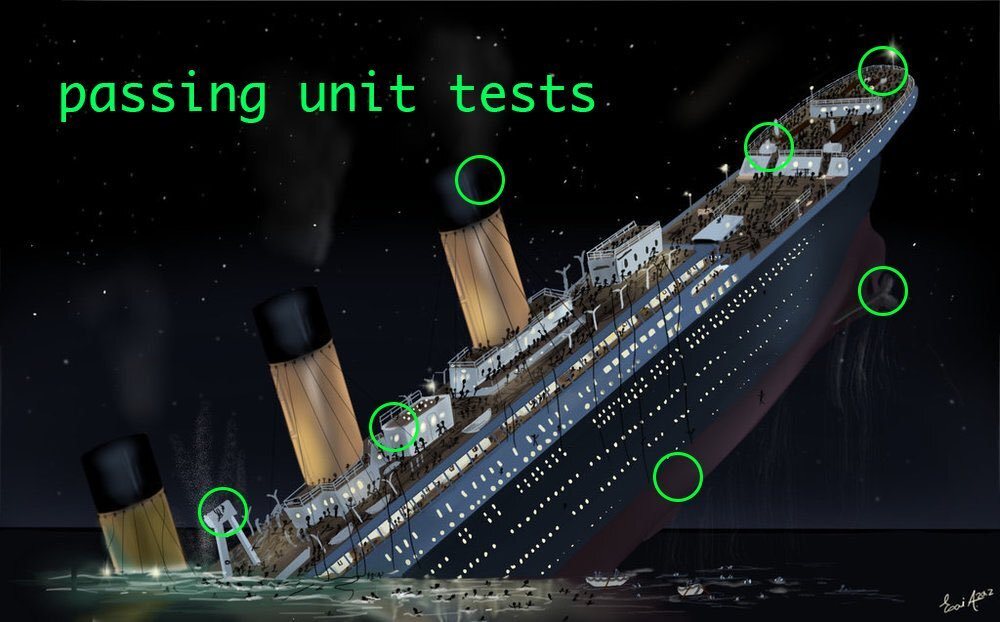

# Testing the Backend
In this lecture, we're going to focus on Integration Tests. Integration tests are little more complicated than Unit tests, but not by much. 

### Big Picture Ideas

1. Difference Between Integration Testing and Unit Testing:

    * Unit testing is just testing small pieces of code like pure/helper/utility functions; testing small, isolated, self-contained functions. 
    
    * Integration testing is testing how functions are working together as a whole, not just a single function. 

2. How have we been running our integration tests up until now? 
    
    * We have been doing it manually, running integration tests against API by using Insomnia to do things like test endpoints to get a response. That's integration testing... It's just manual. 

    * Manual integration testing is extremely slow and tedious. It can be really repetitive. 

3. Why is the act of calling an endpoint considered an integration test? What goes into that endpoint that makes it an integration test and not a unit test? 

    * It's testing multiple parts of the app or system. It's testing the route handler, all of our middleware, the request handling, the response handling, etc. 
    
    * It is testing that whole flow of receiving a request and responding with something. That tests a lot of different functions all at once. 

4. Most of the time, integration tests are way more important than unit tests. If you only have time to write one type of testing in your system, you're going to want to write integration tests. 
    
    * This is _especially_ true in our backends because we want to make sure our app is running as expected. We want to make sure we're not saving corrupt data in the database, for example. 
        
        * Remember, you can't traverse corrupted data in your database -- unless you restore backup of the database somehow. 

        * We have to be really careful with our data, which is why testing is so crucial in the backend. It's really difficult to reverse corrupt data that comes as a result of bugs. 

5. Different types of testing

    * Unit testing is small-time. It's checking self-contained pure/helper/utility functions. Unit testing is like making sure that a light turns on and off. Another example is checking to make sure that the door opens and closes and locks. 

    * But if the ship is sinking, those small details (the unit tests) don't really matter that much. 

    * Integration tests help us to see if our ship is still afloat or if our ship is sinking. That really is the most important thing. 

    <p align="center">
         
    </p>

### Code Along

1. In package.json, add some config for JSON for Integration Testing using Jest.

    ```
    "jest": {
        "testEnvironment": "node"
    },
    ```

2. Try `npm test` now. It's failing because we don't have any tests yet.

3. For Integration Tests, it's usually convention for them to go into their own folder, as opposed to having the test file right next to the file you're testing. 

    * Jest will automatically look for a folder named `__tests__`.

    * Create a new file inside the tests folder called `index.test.js`.

4. Create a placeholder test just to get things going with the test runner. Assert that 2 + 2 is 4.

    ```
    test("a placeholder test", () => {
        expect(2 + 2).toBe(4)
    })
    ```

5. If you run `npm test` again, Jest looks in the test folder and runs our tests on the file.

6. Our placeholder test is a great starting point for unit tests. However, it's not so great for integration tests. 

7. We need a way to call our endpoint from a test. We'll need a library that can call our endpoint, something like Axios was for React. In this case, we're going to use a library called [SuperTest](https://github.com/visionmedia/supertest). 
    
    * You can install it with npm like so: `npm install supertest --save-dev`.

    * Super Test is a library that is similar to Axios. It can make HTTP requests to a server. It also has some built-in functionality for testing against the responses, which is really nice. 

    * Take a look in the [Examples](https://github.com/visionmedia/supertest#example) to see how you can make a test request to our API.

        * Import SuperTest

        * Get an instance of our express app

        * In order to make an HTTP call with SuperTest, we'll have to actually pass the instance of our Express app to the SuperTest request. 
            
            * We're not just making an actual HTTP request, we're passing the instance of our Express app. Then, under the hood, what SuperTest does is it starts our application on some random port, it makes the request, and then it stops our application. 

            * We just passed that instance of our app to our server to the request object when we actually want to make that request. 

        * Then we can assert against different things like headers, status code, or the response. 

        
        ```
        // import SuperTest
        const request = require('supertest');
        const express = require('express');

        // get instance of our express app
        const app = express();

        app.get('/user', function(req, res) {
        res.status(200).json({ name: 'john' });
        });

        // pass in the instance of the express app to the SuperTest request
        request(app)
            // endpoint to test
            .get('/user')
            // make assertions
            .expect('Content-Type', /json/)
            .expect('Content-Length', '15')
            .expect(200)
            .end(function(err, res) {
                if (err) throw err;
            }
        );
        ```
        
8. If we have to pass an instance of our Express app to the SuperTest instance in order to make that request, it's not going to work with the way we have our index file set up at the moment. The server on the index file was never exported. 

    * Update the index file to export the server. 

    ```
    // index.js

    module.exports = server
    ```

    * If we're importing server into our test file, and we're passing server to SuperTest, then SuperTest starts the server behind the scenes. It's making the requests and then it's stopping the server all automatically. What current problem do we have in our index file?

        * We don't want the server to actually start and listen on the port that we define. We don't want this code to run if we're running our testing suite.

        * Since this is something SuperTest does automatically, it's essentially starting the server twice. 

        * We can fix this in a few different ways. 

            * Pull the listening code out and put it in a different file. You could put it in a file called server.js and in your test you would import index, not server.  

            * The easier way is add an if statement around the `server.listen()` code. 

                * If the value of module.parent is undefined, start the server. Otherwise, don't start the server. 

                * All this is saying is: <br> "if this index file is being imported/required into another file, don't actually start the server. Just export the instance of the server but don't start it. Otherwise, if this index file is being run directly with node and it's not being required into anything else, go ahead and start the server."

            ```
            if (module.parent) {
                server.listen(port, () => {
                    console.log(`Running at http://localhost:${port}`)
                })
            }
            ```
